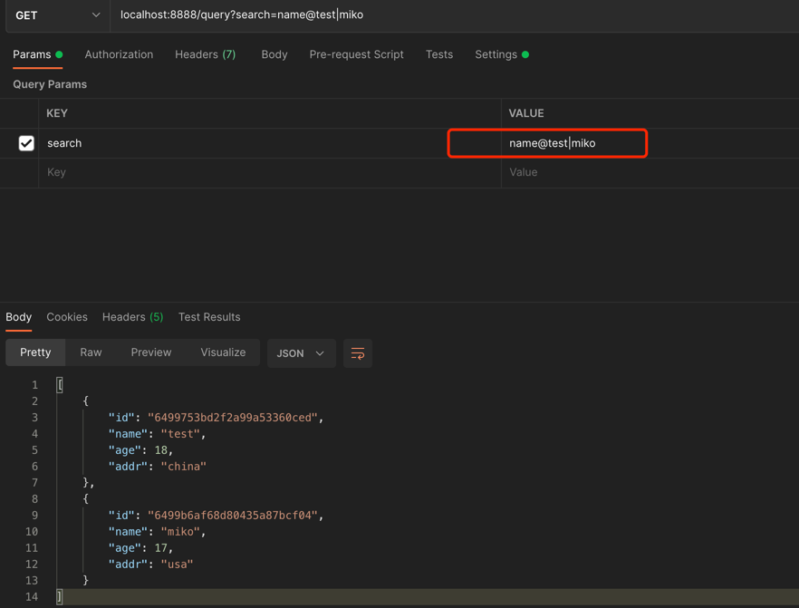

# query-dsl-plus

#### 简介

1. 前台通过字符串传递变量查询参数
2. 后端封装查询场景，一种查询所有数据的方法

#### 在使用querydsl-plus之前

1. webapi使用如下

2. service 像这样写，或者更难，或者随时可能更改到

##### 如果使用了 querydsl-plus, 如下所示, 会变得非常简单

#### Postman 示例

#####  在实际操作中，需要使用编码URI，这里为了方便显示，所以全部没有转换 

#### 快速导入

~~~xml

<dependency>
    <groupId>cn.ljserver.tool</groupId>
    <artifactId>query-dsl-plus</artifactId>
    <version>1.0.0-RELEASE</version>
</dependency>
~~~

#### 私有安装教程

1. 拉取query-dsl-plus代码仓库
2. 发布到自己私有到maven服务器
3. 在你项目的pom.xml文件中引入

#### 快速上手

1. DAO 继承 QuerydslBinderCustomizer
2. Service 继承 SearchService
3. 方法使用示例
   // 搜索字符串，由前端传递, example: search age>18 and addr=addr

   String search = "age>18,addr:addr";

   BooleanExpression exp = this.buildPredicate(search, TestEntity.class);
   
   
   

#### 相关符号使用说明

    case ":"  eq, example: search=name:jack, like sql >> name="jack" 

    case ">"  gt, example: search=age>18, like sql >> age>18 

    case "<"  lt, example: search=age<18, like sql >> age<18 

    case ")"  goe, example: search=age)18, like sql >> age>=18 

    case "("  loe, example: search=age(18, like sql >> age<=18 

    case "!"  né, example: search=age!18, like sql >> age!=18 or age<>18

    case "*"  like, example: search=name*%abc%, like sql >> name like "%abc%"

    case "^"  not like, example: search=name^%abc%, like sql >> name not like "%abc%" 

    case "@"  in, example: search=name@a|b|c, like sql >> name in ("a","b","c")  

    case "#"  contains, example: search=name#abc, like sql >> contains (name,"abc")  

    case "~"  or, example: search=name:abc~age:18, like sql >> name="abc" and age=18  

    case "|"  list separator, example: search=name@a|b|c, like sql >> name in ("a","b","c") 

    other "," params split,more than 2 params, use the "," to separated  

