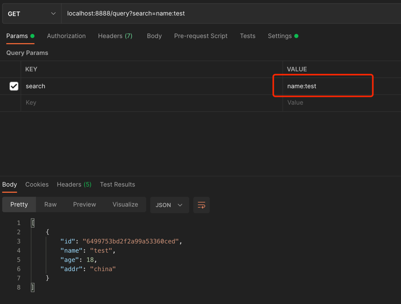
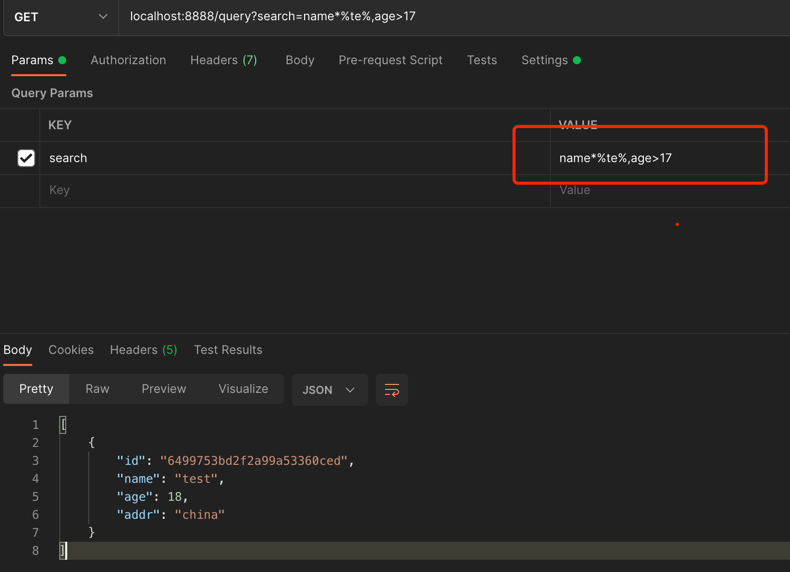

# query-dsl-plus

[中文简介·说明](README.ZH_CN.md)

#### Brief introduction

1. The foreground passes variable query parameters through strings
2. The backend encapsulates the query scenario, a method that query all data
3. One search parameter for all requirements

#### Before use querydsl-plus
1. webapi like this

2. service like this, either it's harder (super many parameters, or simply passed with body), or the requirements may change at any time, causing the parameters to change

##### if use querydsl-plus, like this, so easy and fast

#### Postman Examples 
#####  In practice, you need to use the encode URI, Here for the convenience of display, so all did not convert 

#### quick to import

~~~xml

<dependency>
    <groupId>cn.ljserver.tool</groupId>
    <artifactId>query-dsl-plus</artifactId>
    <version>1.1.0-RELEASE</version>
</dependency>
~~~

#### Installation tutorial

1. pull the query-dsl-plus repository
2. deploy to you maven repository
3. import into you project pom.xml

#### quick to use

1. DAO extends QuerydslBinderCustomizer
2. Service extends SearchService
3. function use
   // search string, passed by the frontend, example: search age>18 and addr=addr

   String search = "age>18,addr:addr";

   BooleanExpression exp = this.buildPredicate(search, TestEntity.class);

4. 

#### Instructions for use

    case ":"  eq, example: search=name:jack, like sql >> name="jack" 

    case ">"  gt, example: search=age>18, like sql >> age>18 

    case "<"  lt, example: search=age<18, like sql >> age<18 

    case ")"  goe, example: search=age)18, like sql >> age>=18 

    case "("  loe, example: search=age(18, like sql >> age<=18 

    case "!"  né, example: search=age!18, like sql >> age!=18 or age<>18

    case "*"  like, example: search=name*%abc%, like sql >> name like "%abc%"

    case "^"  not like, example: search=name^%abc%, like sql >> name not like "%abc%" 

    case "@"  in, example: search=name@a|b|c, like sql >> name in ("a","b","c")  

    case "#"  contains, example: search=name#abc, like sql >> contains (name,"abc")  

    case "~"  or, example: search=name:abc~age:18, like sql >> name="abc" and age=18  

    case "|"  list separator, example: search=name@a|b|c, like sql >> name in ("a","b","c") 

    other "," params split,more than 2 params, use the "," to separated  

